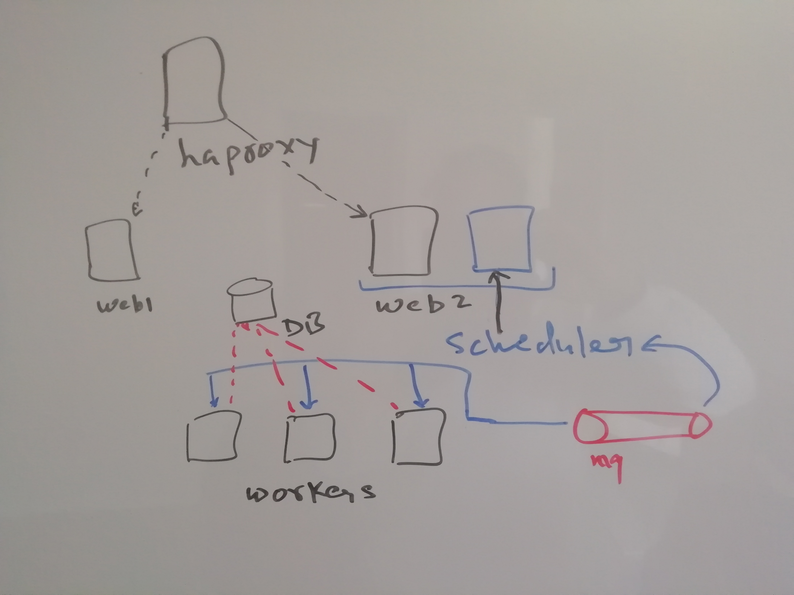

```
# © 2019 Netxillon Technologies.
# Author: Gurmukh Singh
# Email: trainings@netxillon.com
# Date: 22-07-2020
```
```
# You are free to use these as long as you acknowledge it back to the source and give due credit.
# There is no guarantee for the use of these scripts/roles and the author is in no way liable for any damange caused by the use of these scripts.
```

<p align="center">
  
</p>

##### This playbook does the below:

>1. Setup ssh passphraseless access and sudoers files if needed.
>2. Optimize the Centos/RedHat machines in terms of entropy, sysctl, ulimits, network, swap, Selinux, THP, file descriptors etc
>3. Install Utility packages - ntp, devel packages, epel-release etc
>4. Install prequisists for Airflow, rabbitmq (pip3 and python3)
>5. Install and configure Rabbitmq
>6. Install and Configure Airflow
>7. Install MariaDB and Configre it for Airflow if needed. This is MariaDB10.5 as minimum needed is 10.2
>8. Setup HAProxy to point to the webservers

**Make sure you understand YAML and make. YAML does not like "Tabs" but "make" loves it.**

Have setup the **"Make"** file to make execution of scripts easy. Also, make a note that for this to work you must have access to OS repositories
and pip should be able to pull packages from the internet.

This section enables pass-phraseless access and set sudoers for non root users the install user
```
first_step:
	ansible all  -m authorized_key -a "user='centos' state='present' key='{{ lookup('file', '~/.ssh/id_rsa.pub')}}'" -i inventory/test/airflow_hosts -k
	ansible-playbook playbooks/set_sudoers.yml -i inventory/test/airflow_hosts -k -K

The below action does installation of system packages and OS tuning
cluster_prereqs:
	ansible-playbook playbooks/cluster-install.yml -i inventory/test/airflow_hosts  --tags tune-os
	ansible-playbook playbooks/cluster-install.yml -i inventory/test/airflow_hosts  --tags os-packages

The below action reboot the nodes
cluster_reboot:
	ansible-playbook playbooks/reboot.yml -i inventory/test/airflow_hosts --extra-vars reboot=now

# Install HAproxy
cluster_haproxy:
        ansible-playbook playbooks/cluster-install.yml -i inventory/test/airflow_hosts --tags haproxy

# Install MariaDB before executing the next step if MariaDB is not already configured.
cluster_install_mariadb:
        ansible-playbook playbooks/cluster-install.yml -i inventory/test/airflow_hosts  --tags mariadb

# The below action install Rabbitmq and Airflow
cluster_install_airflow_rabbitmq:
	ansible-playbook playbooks/cluster-install.yml -i inventory/test/airflow_hosts  --tags rabbitmq-install
	ansible-playbook playbooks/cluster-install.yml -i inventory/test/airflow_hosts  --tags airflow
```

Execution can be as:
```
make cluster_prereqs
make cluster_install_airflow_rabbitmq
make cluster_install_mariadb
make cluster_reboot
make cluster_haproxy
```
cluster_reboot: This is to reboot all the nodes except the node from which ansible is executed. This is to apply the changes like Selinux etc and make OS boots
up after applying various OS tunings parameters using "make cluster_prereqs"
